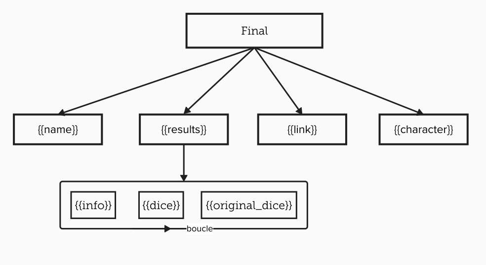

:::tip
Pour ouvrir un menu contextuel, faites un clic droit (ou un appui long sur mobile) sur un message, puis sélectionnez `Application`
:::

# Créer un lien vers un résultat

Cette commande permet de créer un lien direct vers un résultat de dé lancé avec le bot. Utile pour partager un résultat précis dans un autre canal ou avec un autre utilisateur.

Cette commande peut être personnalisée de deux façons :
- Par utilisateur, pour chaque serveur, via la commande `/user_config créer_lien`
- Par serveur, par les administrateurs, via la commande `/config créer_lien`

:::important
Le format du serveur a la priorité sur le format de l'utilisateur.
:::

## Format

:::usage
**`/config créer_lien format [final] (results) (dé) (info) (nom) (dé_original) (personnage) (jointure_résultats)`**
- `dé` : Le résultat du dé en lui-même, généralement `[RES](SIGN)(COMPARAISON)`, par exemple `[29]>=10`.
- `info` : Le texte d'information qui est le texte de critiques (dont customisés), d'échec ou de réussite.
- `nom` : Le nom de la statistique ou de la macro, si une est trouvée.
- `jointure_résultats` : Le texte à utiliser pour joindre plusieurs résultats ensemble.
- `results` : Une liste qui contient la combinaison de `dé` et `info`, joint par la variable `jointure_résultats`.
- `final` : Le format final qui combine les autres variables pour créer le lien.
- `dé_original` : Le dé original lancé, par exemple `1d100`.
- `personnage` : Le nom du personnage ayant lancé le dé.
:::

:::warning
Discord ne permet pas de rajouter des espaces finaux (ou au début) dans les options. Si vous souhaitez ajouter un espace à la fin ou au début d'une des variables, utilisez `\s` pour représenter un espace.
:::

Lorsque les variables sont laissées vides, les valeurs par défaut sont utilisées.

### Variables

Pour simplifier la création du format, vous pouvez utiliser les variables suivantes dans les champs de format :
- `{{dice}}` : Résultat du dé (exemple : `[29]>=10`)
- `{{info}}` : Texte d'information (exemple : `Échec critique`)
- `{{name}}` : Nom de la statistique (exemple : `Force`) ou de la macro
- `{{results}}` : Liste pouvant combiner plusieurs `{{dice}}` et `{{info}}`
- `{{link}}` : Lien vers le message contenant le résultat du dé.
- `{{original_dice}}` : Le dé original lancé (exemple : `1d100`)
- `{{character}}` : Le nom du personnage ayant lancé le dé

Il est aussi possible d'associer des fonctions spécifiques à ces variables, en ajoutant :
- `:upper` : met en majuscule tous les caractères.
- `:lower` : met en minuscule tous les caractères.
- `:title` : met en majuscule la première lettre de chaque mot.
- `:capitalize` : met en majuscule la première lettre uniquement.
- `:standardize` : Supprime les accents en remplaçant par les caractères standards (`é -> e`, `ü -> u`, etc.)
- `:trunc=N` : Tronque à N caractères. Par exemple, `{{name:trunc=5}}` donnera les `5` premiers caractères du nom.
- `:short` : Ne garde que les initiales si le mot en contient plusieurs (exemple : `Jean-Luc Picard` devient `JLP`).
- `:long` : Conserve le mot complet sans modification (exactement comme si aucune option n'était appliquée).
- `:standardize_short` : Fusion entre `:short` et `standardize`, sauf que les accents ne seront supprimés que pour les initiales (exemple : `Émile Zola` devient `EZ` au lieu de `ÉZ`). Doit être utilisé à la place de `:short` et `:standardize`.

Ces options sont appliquées dans l'ordre avec lequel elles sont écrites. Par exemple, `{{name:short:upper}}` donnera les initiales en majuscules.

Ces variables ne sont utilisables que dans les champs de format correspondants, et non dans le champ `final`.

#### Résultats (`{{results}}`)

La variable `{{results}}` est en réalité une liste qui est join par la variable `jointure_résultats`. Cette variable **ne peut** être composée que de :
- `{{dice}}`
- `{{info}}`
- `{{original_dice}}`

#### Final

La variable `final` ne peut contenir que les variables `{{results}}`, `{{link}}`, `{{name}}` et `{{character}}`.



### Défaut

Par défaut, le format est défini comme suit :
- Final : `[[{{name}}{{results}}]](<{{link}}>)`,
- Résultats : ``{{info}} `{{dice}}` ``,
- Jointure résultats :`; `,
- Dé : `{{dice}}`,
- Info : `{{info}} - `,
- Nom : `__{{name}}__: `,
- Dé original : `{{original_dice}}`,
- Personnage : `{{character}}`

Ce qui donne : ``[[__Force__ :  Échec critique - `[29] ⩾ 10`]](<https://discord.com/channels/guildId/channelId/messageId>)``

## Affichage

:::usage
**`/config créer_lien afficher`**
:::

Permet d'afficher la liste des formats de lien actuels pour le serveur, ainsi qu'un exemple basé sur le format suivant :
```
__**Personnage**__ (<@000000000000000000>)  (\`>= 11\`):
[__Nom__]
  **Échec critique** — \`1d100\` ⟶ \`[29]\` = \`[29] ⩾ 10\`
```

## Reset

:::usage
**`/config créer_lien reset`**
:::

Supprime le format personnalisé actuel et rétablit les valeurs par défaut.
