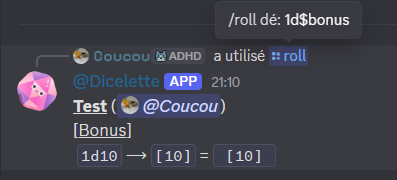
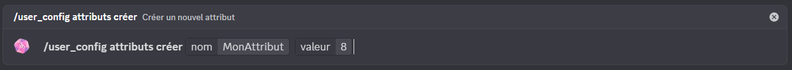
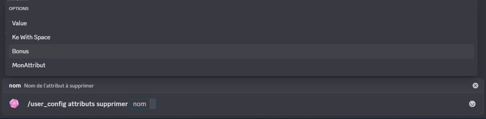
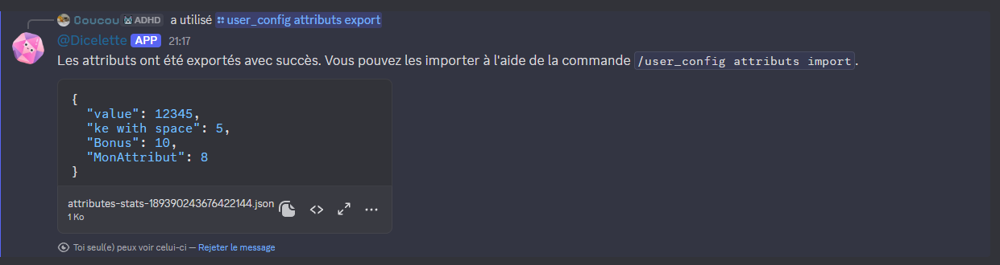
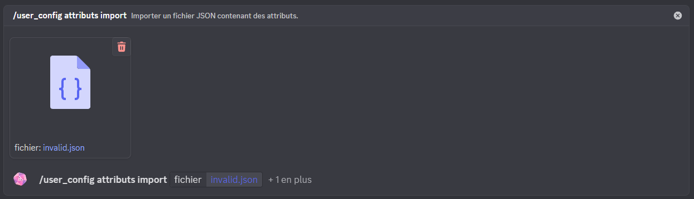
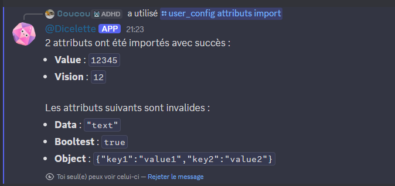

Les ==attributs== permettent à chaque utilisateur de définir et gérer des attributs numériques spécifiques à un serveur, sans la nécessité de configurer un modèle ou en accompagnement du modèle.

:::warning
Si une fiche a des statistiques, les attributs s’y ajoutent, mais les statistiques remplacent les attributs portant le même nom.
:::

:::danger
Pour être utilisé dans un snippet, un attribut doit d’abord être enregistré.
:::

# Usage

Contrairement aux [snippets](snippets.md), les attributs ne sont pas utilisables directement. Ils fonctionnent comme des raccourcis (au même titre que les statistiques) sous forme de clés. Concrètement, cela permet d’utiliser le **nom** d’un attribut dans un jet de dés, préfixé par le symbole `$`.

:::example[`1d$force`]
Lorsque `force` vaut `12`, le dé est automatiquement converti en `1d12`.
:::

Cette syntaxe est utilisable :
- Dans les commandes de jets `/roll`
- Dans la [notation directe](../../usage/message.md)
- Dans les commandes de jets liés aux fiches (`/dbroll`, `/macro`) ainsi que leur équivalent dans `/mj`.
- Dans les commandes `/calc` et `/math` (uniquement dans un serveur)

:::tip
Comme pour les snippets, chaque clé doit être unique. Il est recommandé d’utiliser :
- des noms courts ;
- sans espaces (si un espace est malgré tout utilisé, la valeur reste accessible en remplaçant les espaces par des `_` ou `.`).
- Sans `-` (tiret) car ils peuvent être confondu avec la négation (`$myStat-10`)
:::

:::warning
Les attributs sont stockés globalement au niveau du serveur et sont donc partagés entre tous les personnages d’un même joueur.
:::

# Création d'un attribut

:::usage
**`/user_config attribut créer [nom] [valeur]`**
- `nom` : Nom de l'attribut
- `valeur` : Nombre à enregistrer
:::

Comme pour les snippets, si l’attribut existe déjà, sa valeur sera simplement mise à jour.

# Suppression

:::usage
**`/user_config attributs supprimer [*nom]`**
- `*nom` : Nom du snippet à supprimer
:::

Permet de supprimer un attribut existant depuis la liste des attributs.

# Lister les attributs

:::usage
**`/user_config attributs lister`**
:::

Affiche la liste des attributs existants pour l’utilisateur.

# Exporter les attributs

:::usage
**`/user_config attributs export`**
:::

Permet d’exporter l’ensemble des attributs de l’utilisateur au format JSON, afin de les sauvegarder ou de les partager.

# Importer des attributs

Importe des attributs à partir d’un fichier JSON. Cela permet de transférer ou partager facilement des données entre différents serveurs ou comptes.

:::usage
**`/user_config attributs import [fichier] (?écraser)`**
- `fichier` : Données JSON des attributs à importer
- `?écraser` : Permet d'écraser les données plutôt que de les fusionner avec les anciennes.
:::

Par défaut, les données sont fusionnées. Si deux attributs portent le même nom, l’attribut importé remplacera l’existant.

Lors de l’import, les attributs sont validés et seuls ceux conformes seront ajoutés.

