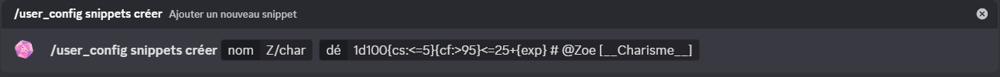
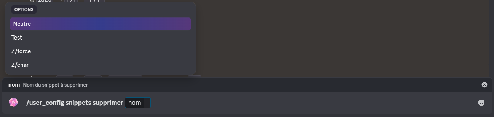
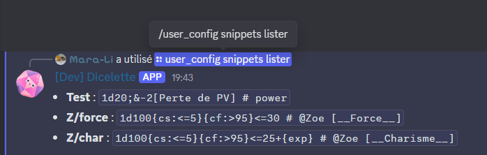
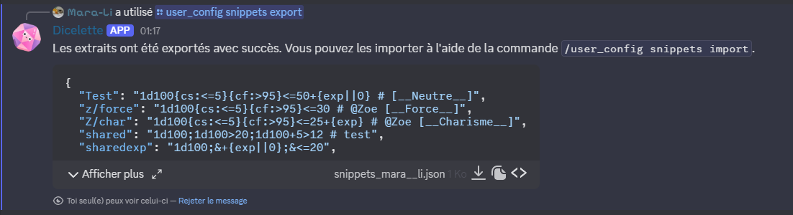
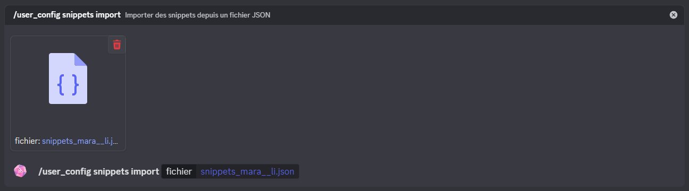

Les ==snippets== sont des dés réutilisables qui ne sont liés ni à un personnage ni à un modèle spécifique. Ils peuvent être créés et utilisés par les utilisateurs pour simplifier les jets de dés fréquents, sans nécessiter de configuration de modèle.

:::important
Les statistiques et attributs ne sont pas pris en charge dans les snippets, car ils ne sont pas liés à un personnage.
:::

# Création de snippets

:::usage
**`/user_config snippets créer [nom] [dé]`**
- `nom` : Nom du snippet
- `dé` : Dé à lancer (ex : `1d20+5`)
:::

Si le snippet existe déjà, le dé sera mis à jour vers la nouvelle valeur.

# Suppression

:::usage
**`/user_config snippets supprimer [*nom]`**
- `*nom` : Nom du snippet à supprimer
:::

Permet de supprimer un snippet existant de la liste.

# Liste des snippets

:::usage
**`/user_config snippets lister`**
:::

Affiche la liste des snippets existants pour l'utilisateur.

# Exporter les snippets

:::usage
**`/user_config snippets export`**
:::

Permet d’exporter tous les snippets de l’utilisateur au format JSON, pour les sauvegarder ou les partager.

# Importer des snippets

Importe des snippets depuis un fichier JSON. Cela permet de transférer ou partager facilement des données entre différents serveurs ou comptes.

:::usage
**`/user_config snippets import [fichier] (?écraser)`**
- `fichier` : Données JSON des snippets à importer
- `?écraser` : Remplace les données existantes au lieu de les fusionner.
:::

Par défaut, les données sont fusionnées. Si deux snippets ont le même nom, le snippet importé remplacera l’existant.

Lors de l’import, les snippets sont validés et seuls ceux conformes seront ajoutés.

