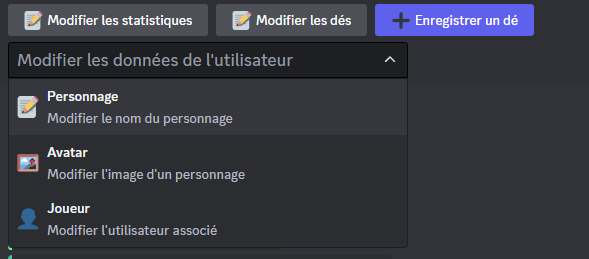
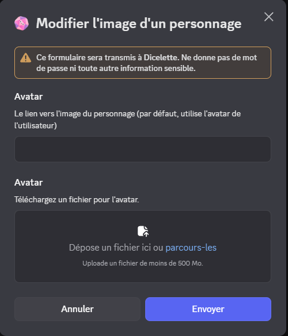

## Modifier les données d'utilisateur



Les commandes du menu déroulant permettent de modifier les données correspondantes.
Si vous utilisez une ancienne version, vous devez utiliser les commandes listées.

### Modification de l'image



:::warning
Les images stockés sur discord ne peuvent être utilisés, car leurs liens changent régulièrement. Il est donc obligatoire d'utiliser des liens externes, par exemple, en utilisant [imgur](https://imgur.com/).

[Regardez ici pour plus d'information](https://kulturegeek.fr/news-298973/discord-passe-liens-temporaires-lhebergement-fichiers).
:::

:::usage[commande]
**`/edit avatar [(lien) (fichier)] (@joueur) (*personnage)`**
- `lien` : Lien de l'image à utiliser.
- `fichier` : Fichier image à uploader.
- `@joueur` : Mention du joueur dont vous souhaitez modifier l'image.
- `*personnage` : Nom du personnage à modifier. Si aucun nom n'est spécifié, l'image sera modifiée pour le personnage sans nom.
:::
Par défaut, la commande modifiera l'image de la personne ayant utilisé la commande. Seuls les modérateurs peuvent modifier l'image d'un autre joueur.

:::important
Si les deux options sont fournies, le fichier aura la priorité.
:::

Même si les deux options sont optionnelles, au moins une d'entre elles doit être fournie, sinon une erreur sera affichée.

### Renommer un personnage


Tout comme la commande listée plus haut, elle ne permet pas d'avoir des personnages ayant les mêmes noms pour un même utilisateur. Dans le cas contraire, l'action sera annulée et une erreur s'affichera.

:::usage[commande]
**`/edit rename [nouveau_nom] (@joueur) (*personnage)`**
- `nouveau_nom` : Nouveau nom du personnage.
- `@joueur` : Mention du joueur dont vous souhaitez modifier le nom du personnage.
- `*personnage` : Nom du personnage à modifier. Si aucun nom n'est spécifié, le nom du personnage sans nom sera modifié.
:::

### Déplacer à un nouvel utilisateur


Cela **déplacera** le personnage à un nouvel utilisateur, supprimant les données du joueur précédent. 
Dans le cas où l'utilisateur "receveur" a un personnage du même nom, l'action sera annulée et une erreur s'affichera.

:::usage[commande]
**`/edit user [@utilisateur] (@joueur) (*personnage)`**
:::

## Modification des statistiques


Le modal sera pré-rempli par une liste comme suit :
```md
- NOM : valeur
- NOM : valeur
- NOM : COMBINAISON
```

:::warning
Il est impératif de conserver cette liste telle quelle pour que le bot puisse lire correctement les statistiques.
:::

Vous pouvez supprimer les valeurs en utilisant `X` ou en laissant vide, comme ceci :
```md
- NOM : X
```

Si des statistiques ont été supprimées du modèle, elles seront automatiquement retirées de la liste. De plus, elles seront automatiquement ajoutées dès leur ajout au modèle, avec une valeur par défaut de "0".

Il est possible de modifier les combinaisons.

Enfin, les valeurs ne seront pas vérifiées par rapport au total enregistré initialement dans le modèle. Les maîtres de jeu doivent donc vérifier les valeurs lors de l'édition.

:::note
Si les statistiques sont modifiées et que les logs sont activés, un message de modification sera envoyé dans le canal configuré dans les logs.
:::

## Modification des dés

Tout comme pour les statistiques, le modal sera pré-rempli par une liste comme suit :
```md
- NOM : dés
```

Tout comme lors de l'enregistrement, les dés seront évalués pour vérifier leur validité. De plus, vous pouvez ajouter autant de dés que vous le souhaitez !

Comme pour les statistiques, il est essentiel de respecter la liste et sa syntaxe. Vous pouvez supprimer des champs en remplaçant la valeur par "X" ou "0".

