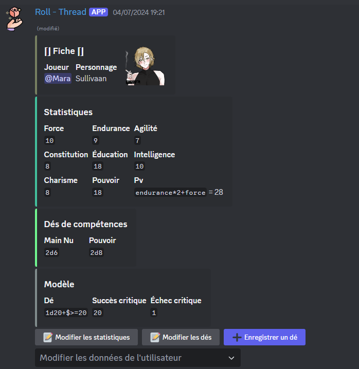

Une fois que l'utilisateur est validé, sa fiche sera automatiquement publiée dans un thread ou dans le canal choisi. Toutes les fiches suivront ce format :

Seul le modèle et l'utilisateur seront toujours présents, à moins qu'aucun dé-type et aucun succès/échec critique n'ont été enregistrés dans le modèle.

Si toutes les informations sont enregistrées, vous aurez accès à trois boutons :
- Modifier l'avatar de l'embed,
- Modifier les statistiques
- Modifier les dés enregistrés (qui permet d'enregistrer plusieurs nouveaux dés, mais shh...)
- Ajouter un nouveau dé.

:::important
Dans le cas où l'[auto-enregistrement](../../config/self_registration.md) est activé **avec** la validation par un modérateur, toutes les modifications proposées sur une fiche doivent être approuvées par un modérateur avant d'être appliquées. Un message contenant les modifications proposées sera envoyé dans le même salon que la fiche ; si un modérateur approuve le message, les modifications sont appliquées, sinon elles sont rejetées (et l'utilisateur en sera informé).  

Le paramètre d'auto-enregistrement **seul** n'empêche pas l'édition des fiches. Pour empêcher entièrement les utilisateurs de modifier leurs fiches, placez-les dans un salon accessible uniquement aux modérateurs.
:::